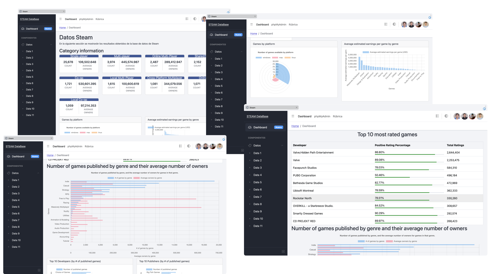
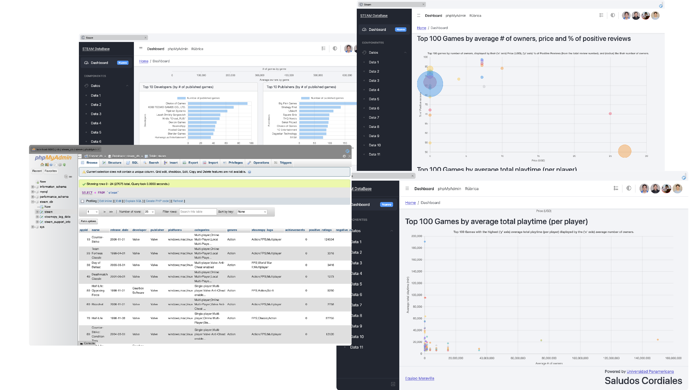

# bda-dashboard

> [!important]
 Se necesita Docker: <https://docs.docker.com/get-docker/>
> y Git <https://git-scm.com/downloads>

Proyecto de bases de datos avanzadas.

## Preview






## Lanzar el proyecto en Docker

Primero se clona el proyecto:
```sh
git clone https://github.com/0rphee/bda-dashboard.git
cd bda-dashboard
```

Antes de correrlo hay que ejecutar:

```sh
git submodule init
git submodule update --remote
```

Se descarga la base de datos:

```sh
# Se ejecuta esto en la misma terminal, si no funciona seguir el paso siguiente
mkdir data
curl 'https://drive.usercontent.google.com/download?id=1IxScbVE5OSBtIDU5xVg_v9G-6d88SFZe&confirm=xxx' -o data/steam_db.sql
```

**Si el comando anterior no funciona**, se descarga el archivo `steam_db.sql` y colocarlo en `data/`, de <https://drive.usercontent.google.com/download?id=1IxScbVE5OSBtIDU5xVg_v9G-6d88SFZe&confirm=xxx>

Una vez hecho esto, **se abre la aplicación de Docker** y se ejecuta esto en la terminal:

```sh
docker compose up --build
```

Alternativamente, se puede usar este comando para lanzarlos otra vez cada que se modifica algún archivo:
```sh
docker compose watch
```

Ya lanzado se puede acceder al **proyecto (dashboard)** en <http://localhost:8000> y a **phpMyAdmin** en <http://localhost:8080>.

Usuarios disponibles para acceder en phpMyAdmin son:

| Usuario | Contraseña |
|---------|------------|
| root    | root       |
| dbuser  | dbuser     |

## Cerrar el proyecto

Para cerrar los servidores (contenedroes), presionen Ctrl+c en la terminal con que lo lanzaron (sea `docker compose up --build` o `docker compose watch`). O desde Docker Desktop, ir a la sección de 'Contenedores', seleccionarlos y pulsar en el botón de borrar (basura).

Si gustan lanzarlos otra vez, solo ejecuten alguno de los comandos de docker descritos previamente.
